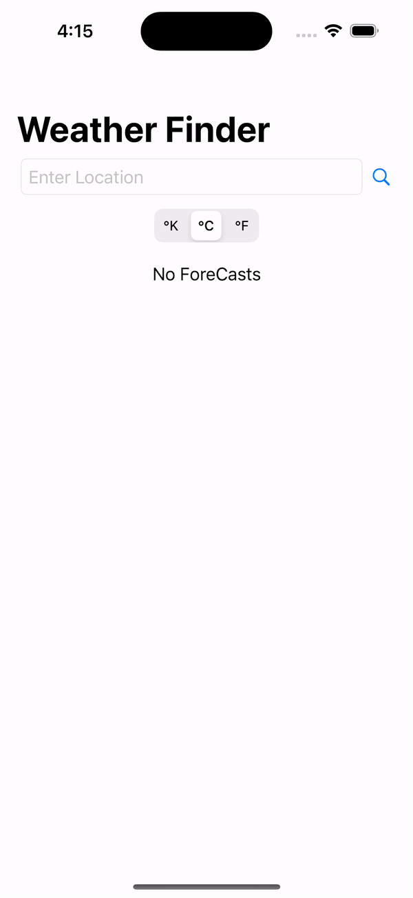

# Weather App

# Demo

## Api
* use [Open Weather Api](https://openweathermap.org/forecast5) to get weather details

### How to use this application.
* clone the application and open the WeatherApp.xcodeproj file.
* replace your open weather api key in [NetworkManager.swift](https://github.com/vinaykumar0339/SwiftUIApps/blob/main/WeatherApp/WeatherApp/Network/NetworkManager.swift#L14) file